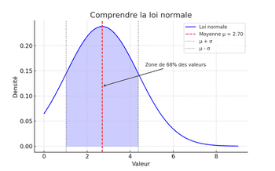
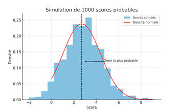
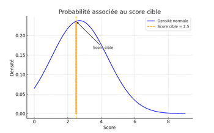
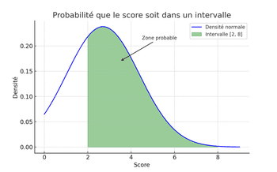

# ⚽ Prédiction de Score Sportif avec la Loi Normale

### Bienvenue dans ce projet de prédiction du score d'une équipe sportive, basé sur **les performances passées** et modélisé à l’aide de la **loi de probabilité normale (ou loi de Gauss)**.

---
# 🧑‍🏫 Comprendre la loi normale

### 🔍 Qu’est-ce que la **loi normale** ?

La loi normale est une **courbe en cloche** qu'on utilise pour représenter les valeurs les plus fréquentes autour d'une moyenne. Dans le cadre sportif, elle nous aide à prédire les scores **les plus probables** qu’une équipe pourrait atteindre.



* **Moyenne (μ)** : c’est le score typique de l’équipe.
* **Écart-type (σ)** : c’est une mesure de la **variabilité** des scores.

  * Un petit σ = l’équipe est régulière.
  * Un grand σ = les scores varient beaucoup.

---

# 💡 Exemple d’utilisation

1. Rendez-vous sur [🔗 l’application en ligne](https://sport-prediction.streamlit.app)
2. Saisissez les scores d’une équipe dans le champ prévu (exemple : `2,1,3,2,4,2`)
3. Observez :
   * Le score moyen et la variabilité
   * Un histogramme des scores simulés
   * La probabilité qu’un score atteigne une valeur précise
   * La probabilité qu’il soit compris dans une plage

---

# 🧠 Ce que fait l’application

* Vous entrez les scores passés d’une équipe (ex. 1, 2, 2, 3, 3, 2).
* L’application calcule :

  * Le score moyen (μ)
  * L’écart-type (σ)
* Elle simule 1000 scores potentiels.
* Elle estime :

  * La **probabilité** qu’un score particulier apparaisse
  * La **probabilité** qu’il soit compris dans une **plage donnée** (ex. entre 1 et 3)

---
# 🔍 Aperçu 

### 1. Simulation de scores



### 2. Probabilité d’un score cible (ex: 2.5)



### 3. Probabilité dans un intervalle de score (ex: [2, 8])


---
## 🛠️ Technologies utilisées

| Outil / Librairie | Rôle dans le projet                        |
| ----------------- | ------------------------------------------ |
| `Streamlit`       | Interface Web interactive                  |
| `NumPy`           | Calcul de la moyenne et écart-type         |
| `SciPy`           | Fonctions de la loi normale (`pdf`, `cdf`) |
| `Matplotlib`      | Affichage des histogrammes                 |
| `Python`          | Langage principal                          |

---

## 🚀 Déploiement local

1. Clonez ce dépôt :

```bash
git clone https://github.com/votre-utilisateur/sport-prediction-normal-distribution.git
cd sport-prediction-normal-distribution
```

2. Installez les dépendances :

```bash
pip install -r requirements.txt
```

3. Lancez l'application :

```bash
streamlit run sport_predictor.py
```

---

## ☁️ Déploiement dans le cloud

Déployée gratuitement sur [Streamlit Cloud](https://streamlit.io/cloud).

Pour déployer la vôtre :

1. Créez un compte Streamlit.
2. Connectez votre repo GitHub.
3. Sélectionnez `sport_predictor.py` comme fichier principal.
4. L’application sera disponible à une URL du type `https://your-app.streamlit.app`.

---

## 📧 Contact

Projet réalisé par : **\[Rijamampianina]**
📩 Contact : \[[rijamampianina@gmail.com](mailto:rijamampianina@gmail.com)]

---

## 📄 Licence

Ce projet est libre d’usage éducatif.
